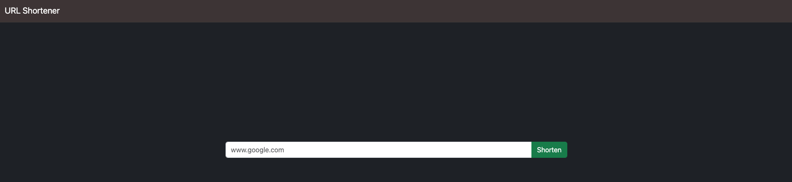
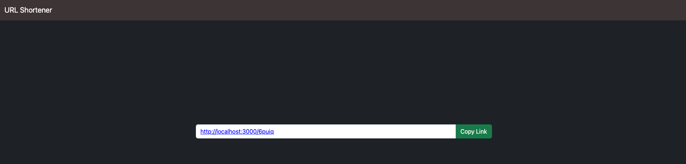

# AC-2-3-A11 URL Shortener

URL Shortener created by node.js, mongodb and express.




## Features

- Shorten an URL.
- Forward to the original URL through the short URL.
- Copy the short URL on the page button.

## How to use

1. Clone the Repo to local server.
```bash
    git clone https://github.com/paulwu-tw/shorten-url.git
```

2. Install need package by follow cmd.
```bash
    npm install
```

3. Touch a .env file, and config MongoDB connect info below.
```bash
    MONGODB_URI=<Your own connection string>
    MONGODB_USER=<Username>
    MONGODB_PASSWORD=<Password>
```

4. Start server for demo.
```bash
    npm run dev
```

5. While see the message below, open browser and enter the following URL. 
```bash
    Listen on http://localhost:3000
```

6. Stop server
```bash
    cmd + c
```

## Built with

- Node.js: 18.15.0
- Express: 4.18.2
- Express-handlebars: 7.0.7
- MongoDB Altas
- mongoose: 7.1.0
- dotenv: 16.0.3